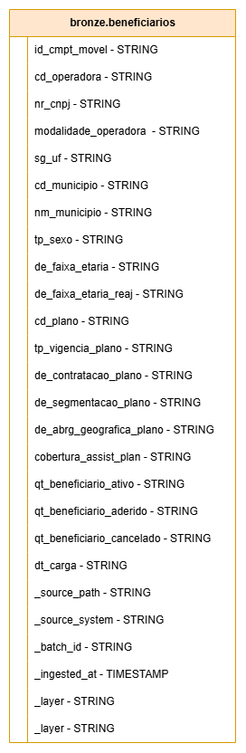
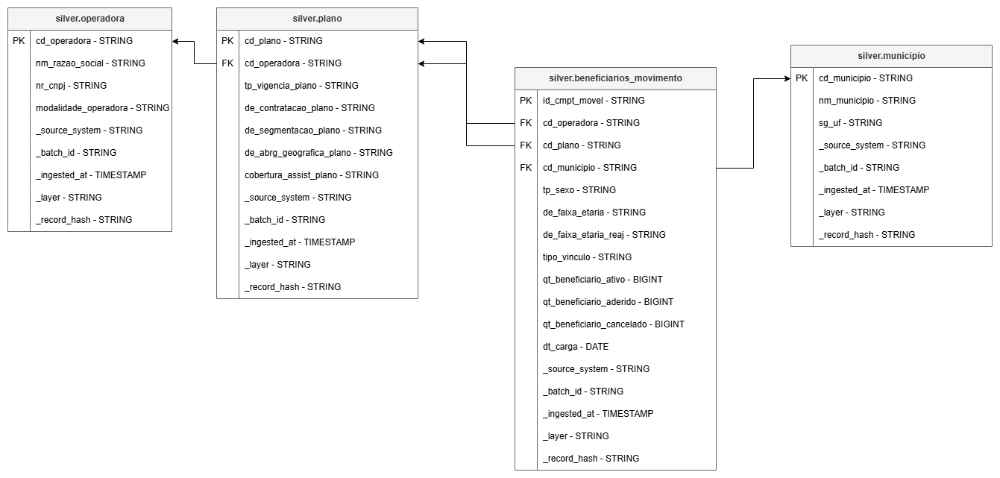

# Beneficiarios ANS

Projeto de pipeline de dados para ingestao e tratamento dos dados publicos de beneficiarios da ANS, com organizacao em camadas de Data Lake:

- **Raw**: arquivos extraidos da ANS publicados no HDFS.
- **Bronze**: leitura dos CSVs crus, normalizacao tecnica e carga incremental em tabela Iceberg.
- **Silver**: limpeza, validacao, deduplicacao e modelagem das entidades analiticas em tabelas Iceberg.

O projeto foi criado para execucao em ambiente Big Data com Hadoop HDFS, Spark, Hive Metastore, Apache Iceberg e JupyterHub/JupyterLab.

## Estrutura

```text
.
├── ans_ingestion/              # Pipeline Python de ingestao da ANS para HDFS raw
├── img/                        # Diagramas e imagens da documentacao
├── pipeline_utils/             # Funcoes reutilizaveis para Spark, Iceberg e qualidade
├── load_bronze_layer.ipynb     # Notebook de carga da camada Bronze
├── load_silver_layer.ipynb     # Notebook de carga da camada Silver
├── utils.py                    # Barrel module para importar utilitarios nos notebooks
└── README.md
```

## Fluxo de dados

```text
Portal de Dados Abertos ANS
        |
        v
ans_ingestion
        |
        v
HDFS raw: /dados/raw/ans/YYYYMM/
        |
        v
load_bronze_layer.ipynb
        |
        v
Iceberg: bronze.beneficiarios
        |
        v
load_silver_layer.ipynb
        |
        v
Iceberg: silver.operadora
         silver.municipio
         silver.plano
         silver.beneficiario_movimento
         silver.beneficiario_rejeitado
```

## Componentes principais

### `ans_ingestion/`

Pipeline Python responsavel por:

- listar as competencias disponiveis no diretorio publico da ANS;
- selecionar a competencia mais recente dentro dos filtros configurados;
- baixar arquivos ZIP validos;
- validar os caminhos internos dos ZIPs;
- extrair os arquivos localmente;
- publicar os dados no HDFS usando area de staging;
- evitar reprocessamento de competencias ja publicadas.

Veja a documentacao detalhada em [`ans_ingestion/README.md`](ans_ingestion/README.md).

### `load_bronze_layer.ipynb`

Notebook Spark que le os arquivos da camada raw e grava a tabela `bronze.beneficiarios` em Iceberg.



A camada Bronze mantem os dados proximos ao formato original recebido da ANS. As colunas de negocio sao gravadas como `STRING`, evitando perda de informacao por inferencia automatica de tipos na primeira etapa do pipeline. Alem disso, a tabela recebe metadados tecnicos como `_source_path`, `_source_system`, `_batch_id`, `_ingested_at` e `_layer`, que permitem rastrear a origem de cada registro, controlar reprocessamentos e conectar a Bronze com as transformacoes posteriores da Silver.

Principais responsabilidades:

- leitura recursiva dos CSVs em `HDFS_BASE_URI/dados/raw/ans/`;
- normalizacao dos nomes de colunas;
- cast tecnico das colunas para string;
- inclusao de metadados de ingestao;
- calculo de hash tecnico do registro;
- filtro incremental por `_source_path`;
- append em tabela Iceberg.

### `load_silver_layer.ipynb`

Notebook Spark que transforma a Bronze em tabelas Silver.



A camada Silver separa a tabela Bronze em entidades mais limpas e reutilizaveis. `silver.beneficiario_movimento` preserva a granularidade do movimento por competencia e se relaciona com as tabelas de referencia `silver.operadora`, `silver.plano` e `silver.municipio`. Nessa etapa, campos numericos e datas passam a ter tipos apropriados, regras de qualidade sao aplicadas e registros invalidos seguem para `silver.beneficiario_rejeitado` com o motivo da rejeicao.

Principais responsabilidades:

- leitura da tabela `bronze.beneficiarios`;
- selecao do batch mais recente ou batch definido;
- limpeza de strings, datas, codigos e identificadores;
- validacao de colunas obrigatorias;
- deduplicacao deterministica;
- separacao de registros rejeitados;
- escrita nas tabelas Silver via merge ou substituicao por particao.

### `pipeline_utils/`

Pacote de apoio usado pelos notebooks:

- `dataframe_io.py`: leitura CSV, normalizacao de nomes e casts.
- `layer_metadata.py`: metadados Bronze e Silver.
- `record_hash.py`: hash tecnico de payload.
- `iceberg_catalog.py`: criacao/validacao de namespaces Iceberg/Hive.
- `iceberg_writes.py`: append, merge, replace por particao e filtro incremental.
- `silver_cleaning.py`: funcoes de limpeza e parsing.
- `silver_quality.py`: validacoes, rejeicoes e deduplicacao.
- `pipeline_config.py`: leitura de configuracoes de ambiente.

## Requisitos

- Python 3.12+
- Hadoop HDFS
- WebHDFS habilitado
- Apache Spark com suporte a Iceberg
- Hive Metastore
- JupyterLab/JupyterHub para execucao dos notebooks
- Dependencias Python de `ans_ingestion/requirements.txt`

Instale as dependencias da ingestao:

```bash
pip install -r ans_ingestion/requirements.txt
```

## Configuracao

As principais variaveis de ambiente sao:

```bash
export HDFS_BASE_URI=hdfs://localhost:9000
export HDFS_WEB_URL=http://localhost:9870
export HDFS_USER=edivan

export ANS_SOURCE_URL=https://dadosabertos.ans.gov.br/FTP/PDA/informacoes_consolidadas_de_beneficiarios-024/
export ANS_SOURCE_START_PERIOD=
export ANS_SOURCE_END_PERIOD=
export ANS_HDFS_DIR=hdfs://localhost:9000/dados/raw/ans/
export ANS_LOCAL_TMP_DIR=/tmp/ans
export ANS_REQUEST_TIMEOUT_SECONDS=60
export ANS_DOWNLOAD_RETRIES=3
export ANS_DOWNLOAD_RETRY_BACKOFF_SECONDS=5
export LOG_LEVEL=INFO
```

Existe um exemplo em [`ans_ingestion/.env.example`](ans_ingestion/.env.example).

## Execucao

### 1. Ingerir dados crus para o HDFS

Na raiz do projeto:

```bash
python -m ans_ingestion.main
```

A carga publica os arquivos em:

```text
/dados/raw/ans/YYYYMM/
```

### 2. Carregar a camada Bronze

Abra e execute:

```text
load_bronze_layer.ipynb
```

Resultado esperado:

```text
bronze.beneficiarios
```

### 3. Carregar a camada Silver

Abra e execute:

```text
load_silver_layer.ipynb
```

Resultados esperados:

```text
silver.operadora
silver.municipio
silver.plano
silver.beneficiario_movimento
silver.beneficiario_rejeitado
```

## Testes

A suite de testes cobre principalmente a ingestao:

```bash
python -m unittest discover ans_ingestion/tests
```

## Observacoes operacionais

- A ingestao raw e incremental por competencia.
- A Bronze evita reprocessar arquivos ja registrados por `_source_path`.
- A Silver usa `_record_hash` para comparar alteracoes e preservar cargas idempotentes quando possivel.
- Configure `HDFS_BASE_URI` antes de executar os notebooks, pois os caminhos de warehouse, raw e checkpoint dependem dele.
- Para reprocessamentos controlados, revise as variaveis e flags usadas diretamente nos notebooks antes da execucao.
