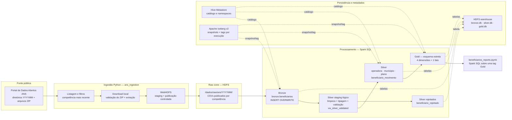
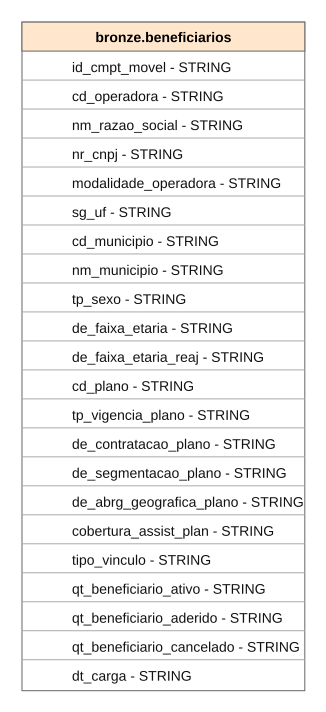
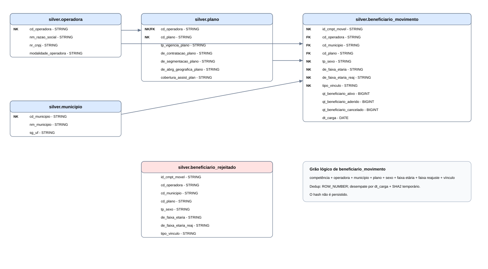
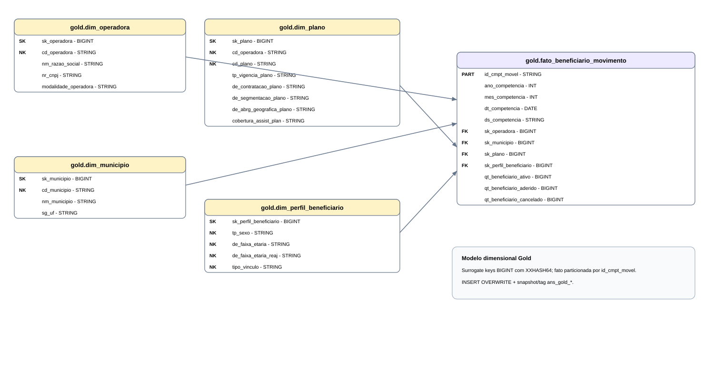

# Beneficiários ANS — Iceberg Warehouse

Pipeline e Data Warehouse para ingestão e tratamento dos dados públicos de beneficiários da ANS, construído com **Python**, **Hadoop HDFS**, **Apache Spark**, **Spark SQL**, **Apache Iceberg** e **Hive Metastore**.

O projeto segue uma arquitetura Medallion:

- **Raw**: arquivos extraídos da ANS e publicados no HDFS por competência.
- **Bronze**: cópia estruturada dos CSVs em uma tabela Iceberg, mantendo os campos de negócio como `STRING`.
- **Silver**: limpeza, tipagem, validação, deduplicação, separação de entidades e registros rejeitados.
- **Gold**: Data Warehouse dimensional em esquema estrela para consultas e relatórios.

As camadas Bronze, Silver e Gold são materializadas como tabelas **Apache Iceberg v2** registradas no **Hive Metastore** e armazenadas no **HDFS**. O histórico técnico das execuções é mantido por **snapshots e tags do Iceberg**, sem adicionar colunas operacionais às linhas das tabelas.

## Arquitetura do projeto


```mermaid
flowchart LR
    subgraph SOURCE["Fonte pública"]
        ANS["Portal de Dados Abertos ANS<br/>diretórios YYYYMM + arquivos ZIP"]
    end

    subgraph INGESTION["Ingestão Python — ans_ingestion"]
        LIST["Listagem e filtros<br/>competência mais recente"]
        DOWNLOAD["Download local<br/>validação do ZIP + extração"]
        STAGING["WebHDFS<br/>staging + publicação controlada"]
    end

    subgraph RAWZONE["Raw zone — HDFS"]
        RAW["/dados/raw/ans/YYYYMM/<br/>CSVs publicados por competência"]
    end

    subgraph PROCESSING["Processamento — Spark SQL"]
        BRONZE["Bronze<br/>bronze.beneficiarios<br/>INSERT OVERWRITE"]
        VALIDATE["Silver staging lógico<br/>limpeza + tipagem + validação<br/>vw_silver_validated"]
        SILVER["Silver<br/>operadora · municipio · plano<br/>beneficiario_movimento"]
        REJECTED["Silver rejeitados<br/>beneficiario_rejeitado"]
        GOLD["Gold — esquema estrela<br/>4 dimensões + 1 fato"]
    end

    REPORTS["beneficiarios_reports.ipynb<br/>Spark SQL sobre uma tag Gold"]

    subgraph PLATFORM["Persistência e metadados"]
        HDFS["HDFS warehouse<br/>bronze.db · silver.db · gold.db"]
        HMS["Hive Metastore<br/>catálogo e namespaces"]
        ICEBERG["Apache Iceberg v2<br/>snapshots + tags por execução"]
    end

    ANS --> LIST --> DOWNLOAD --> STAGING --> RAW
    RAW --> BRONZE --> VALIDATE
    VALIDATE --> SILVER
    VALIDATE --> REJECTED
    SILVER --> GOLD --> REPORTS

    BRONZE -. tabelas .-> HDFS
    SILVER -. tabelas .-> HDFS
    REJECTED -. tabela .-> HDFS
    GOLD -. tabelas .-> HDFS

    HMS -. catálogo .-> BRONZE
    HMS -. catálogo .-> SILVER
    HMS -. catálogo .-> GOLD

    ICEBERG -. snapshot/tag .-> BRONZE
    ICEBERG -. snapshot/tag .-> SILVER
    ICEBERG -. snapshot/tag .-> GOLD
```

### Fluxo resumido

```text
Portal ANS
   ↓
ans_ingestion
   ↓
HDFS raw: /dados/raw/ans/YYYYMM/
   ↓
load_bronze_layer.ipynb + bronze_insert.sql
   ↓
Iceberg: bronze.beneficiarios
   ↓
load_silver_layer.ipynb + silver_*.sql
   ├── silver.operadora
   ├── silver.municipio
   ├── silver.plano
   ├── silver.beneficiario_movimento
   └── silver.beneficiario_rejeitado
   ↓
load_gold_layer.ipynb + gold_*.sql
   ├── gold.dim_operadora
   ├── gold.dim_municipio
   ├── gold.dim_plano
   ├── gold.dim_perfil_beneficiario
   └── gold.fato_beneficiario_movimento
   ↓
beneficiarios_reports.ipynb
```

### Decisões arquiteturais

| Aspecto | Implementação atual |
|---|---|
| Ingestão Raw | Incremental por competência; a competência já publicada é ignorada. |
| Publicação Raw | Staging no HDFS e troca controlada para o destino final, com backup/rollback temporário. |
| Transformações | SQL completo executado por `spark.sql`; Python configura e orquestra os notebooks. |
| Bronze | Carga completa com `INSERT OVERWRITE`; campos de negócio permanecem `STRING`. |
| Silver | Limpeza, tipagem, validação, rejeição e deduplicação determinística com `ROW_NUMBER()`. |
| Gold | Esquema estrela com quatro dimensões e uma fato; surrogate keys `BIGINT` com `XXHASH64`. |
| Persistência | Tabelas Apache Iceberg v2 no HDFS. |
| Catálogo | Hive Metastore por meio do catálogo Spark/Iceberg. |
| Histórico técnico | Snapshots e tags `ans_bronze_*`, `ans_silver_*` e `ans_gold_*`. |
| Relatórios | Leitura de uma tag Gold explícita para manter consistência entre fato e dimensões. |

## Estrutura do repositório

```text
.
├── ans_ingestion/                 # Pipeline Python: ANS -> HDFS raw
├── img/
│   ├── bronze-beneficiarios.drawio
│   ├── bronze-beneficiarios.drawio.svg
│   ├── silver-ans.drawio
│   ├── silver-ans.drawio.svg
│   ├── gold-ans.drawio
│   └── gold-ans.drawio.svg
├── pipeline_utils/
│   ├── iceberg_catalog.py         # Namespaces, validação de schema e tags Iceberg
│   ├── pipeline_config.py         # Configuração HDFS/Spark
│   ├── constants.py
│   ├── sql/                       # Transformações SQL completas
│   └── tests/                     # Contratos estáticos dos pipelines SQL
├── load_bronze_layer.ipynb        # Raw -> Bronze
├── load_silver_layer.ipynb        # Bronze -> Silver
├── load_gold_layer.ipynb          # Silver -> Gold
├── beneficiarios_reports.ipynb    # Relatórios sobre a Gold versionada
├── utils.py
└── README.md
```

Os arquivos `.drawio` são as fontes editáveis dos modelos; os `.svg` são as versões renderizadas usadas neste README.

## Camada Raw — `ans_ingestion/`

O pacote `ans_ingestion` executa a ingestão dos dados públicos antes de qualquer transformação Spark. Ele lista as competências no portal da ANS, seleciona a mais recente, filtra os ZIPs válidos, baixa e valida os arquivos, extrai os CSVs e publica a competência no HDFS via WebHDFS.

A publicação usa uma pasta de staging e só substitui o destino final após a carga completa. Se já existir um destino, ele é movido temporariamente para backup e restaurado caso a troca falhe.

Destino final:

```text
/dados/raw/ans/YYYYMM/
```

A documentação detalhada está em [`ans_ingestion/README.md`](ans_ingestion/README.md).

## Camada Bronze

`load_bronze_layer.ipynb` lê recursivamente os CSVs da Raw, cria uma view temporária CSV e materializa `spark_catalog.bronze.beneficiarios` em Iceberg.



[Arquivo editável no draw.io](img/bronze-beneficiarios.drawio)

A tabela contém somente os **22 campos de negócio** do pipeline atual. Todos são persistidos como `STRING`, inclusive as três quantidades e `dt_carga`.

Não existem mais colunas técnicas como `_batch_id`, `_source_path`, `_source_system`, `_ingested_at`, `_layer` ou `_record_hash`.

A materialização usa `pipeline_utils/sql/bronze_insert.sql` e `INSERT OVERWRITE`. Ao final da execução é criada uma tag:

```text
ans_bronze_YYYYMMDDHHMMSS_<uuid>
```

## Camada Silver

`load_silver_layer.ipynb` transforma a Bronze em cinco tabelas Iceberg.



[Arquivo editável no draw.io](img/silver-ans.drawio)

```text
silver.operadora
silver.municipio
silver.plano
silver.beneficiario_movimento
silver.beneficiario_rejeitado
```

`silver_validated.sql` cria `vw_silver_validated` e concentra a limpeza e validação: normalização de nulos, limpeza de códigos, padronização textual, validação de UF/sexo/CNPJ/competência, conversão das medidas para `BIGINT` e de `dt_carga` para `DATE`.

O grão lógico de `silver.beneficiario_movimento` é:

```text
id_cmpt_movel
+ cd_operadora
+ cd_municipio
+ cd_plano
+ tp_sexo
+ de_faixa_etaria
+ de_faixa_etaria_reaj
+ tipo_vinculo
```

A deduplicação usa `ROW_NUMBER()` nesse grão, ordenando por `dt_carga DESC` e por um `business_row_hash` `SHA2-256` apenas como desempate. O hash é temporário e **não é persistido** na Silver.

`silver.plano` usa a chave natural composta `cd_operadora + cd_plano`. Os registros inválidos são direcionados para `silver.beneficiario_rejeitado`.

As cinco tabelas são recompostas com `INSERT OVERWRITE` e recebem uma tag comum:

```text
ans_silver_YYYYMMDDHHMMSS_<uuid>
```

## Camada Gold

`load_gold_layer.ipynb` transforma a Silver em um esquema estrela.



[Arquivo editável no draw.io](img/gold-ans.drawio)

Dimensões:

```text
gold.dim_operadora
gold.dim_municipio
gold.dim_plano
gold.dim_perfil_beneficiario
```

Fato:

```text
gold.fato_beneficiario_movimento
```

As surrogate keys `sk_operadora`, `sk_municipio`, `sk_plano` e `sk_perfil_beneficiario` são `BIGINT` determinísticos gerados com `XXHASH64` a partir das chaves naturais.

A fato contém a competência, quatro surrogate keys e as medidas:

```text
qt_beneficiario_ativo
qt_beneficiario_aderido
qt_beneficiario_cancelado
```

Ela é particionada por `id_cmpt_movel`.

Os hashes `SHA2-256` usados nos SQLs Gold servem somente para desempate determinístico e não fazem parte do schema final. Todas as tabelas Gold são materializadas com `INSERT OVERWRITE` e recebem a mesma tag da execução:

```text
ans_gold_YYYYMMDDHHMMSS_<uuid>
```

## SQL-first

As transformações ficam em consultas SQL completas dentro de `pipeline_utils/sql/`:

```text
bronze_insert.sql

silver_validated.sql
silver_operadora.sql
silver_municipio.sql
silver_plano.sql
silver_movimento.sql
silver_rejeitados.sql

gold_dim_operadora.sql
gold_dim_municipio.sql
gold_dim_plano.sql
gold_dim_perfil.sql
gold_fato_movimento.sql
```

Os notebooks usam Python somente para configuração da sessão, caminhos, criação de namespaces, validação de colunas, leitura dos arquivos SQL, execução via `spark.sql` e criação das tags Iceberg.

## Apache Iceberg, Hive Metastore e HDFS

Os namespaces são criados em:

```text
${HDFS_BASE_URI}/user/hive/warehouse/bronze.db
${HDFS_BASE_URI}/user/hive/warehouse/silver.db
${HDFS_BASE_URI}/user/hive/warehouse/gold.db
```

As tabelas usam Iceberg `format-version=2`. Cada `INSERT OVERWRITE` cria um snapshot; `tag_current_snapshot` lê a metadata table `<tabela>.snapshots` e associa uma tag ao snapshot mais recente.

O histórico de execução fica, portanto, nos metadados nativos do Iceberg, em vez de ser repetido em cada linha das tabelas.

## Relatórios reproduzíveis

`beneficiarios_reports.ipynb` consulta o modelo Gold por uma tag explícita:

```bash
export ICEBERG_GOLD_TAG=ans_gold_YYYYMMDDHHMMSS_UUID
```

A mesma tag é aplicada à fato e às quatro dimensões, evitando misturar estados de execuções diferentes.

Os relatórios atuais incluem análises por competência, UF, operadora, sexo/faixa etária, tipo de vínculo, evolução temporal, plano e município.

## Requisitos

- Python 3.12+
- Hadoop HDFS
- WebHDFS habilitado
- Apache Spark com suporte a Apache Iceberg
- Hive Metastore
- JupyterLab/JupyterHub
- dependências de `ans_ingestion/requirements.txt`

```bash
pip install -r ans_ingestion/requirements.txt
```

## Configuração

```bash
export HDFS_BASE_URI=hdfs://localhost:9000
export HDFS_WEB_URL=http://localhost:9870
export HDFS_USER=edivan

export ANS_SOURCE_URL=https://dadosabertos.ans.gov.br/FTP/PDA/informacoes_consolidadas_de_beneficiarios-024/
export ANS_SOURCE_START_PERIOD=
export ANS_SOURCE_END_PERIOD=
export ANS_HDFS_DIR=hdfs://localhost:9000/dados/raw/ans/
export ANS_LOCAL_TMP_DIR=/tmp/ans
export ANS_REQUEST_TIMEOUT_SECONDS=60
export ANS_DOWNLOAD_RETRIES=3
export ANS_DOWNLOAD_RETRY_BACKOFF_SECONDS=5
export LOG_LEVEL=INFO

# Necessária para o notebook de relatórios
export ICEBERG_GOLD_TAG=ans_gold_YYYYMMDDHHMMSS_UUID
```

Existe um exemplo em [`ans_ingestion/.env.example`](ans_ingestion/.env.example).

## Execução

```bash
# 1. Raw
python -m ans_ingestion.main
```

Depois, execute em ordem:

```text
2. load_bronze_layer.ipynb
3. load_silver_layer.ipynb
4. load_gold_layer.ipynb
5. beneficiarios_reports.ipynb
```

## Testes

```bash
PYTHONPATH=ans_ingestion:. python -m unittest discover -s ans_ingestion/tests
PYTHONPATH=ans_ingestion:. python -m unittest discover -s pipeline_utils/tests
```

## Observações operacionais

- A Raw é incremental por competência; Bronze, Silver e Gold são recomputadas integralmente.
- A publicação Raw usa staging para evitar disponibilizar competências parcialmente carregadas.
- As tabelas analíticas armazenam somente colunas do modelo; metadados técnicos ficam no histórico do Iceberg.
- `business_row_hash` e `fact_row_hash` são artefatos temporários de transformação.
- As surrogate keys Gold são `BIGINT` geradas por `XXHASH64`; não são hashes criptográficos.
- A fato Gold é particionada por `id_cmpt_movel`.
- Relatórios históricos devem usar uma tag Gold explícita.
- Tags e snapshots devem ter uma política de retenção compatível com auditoria e reprodutibilidade.
