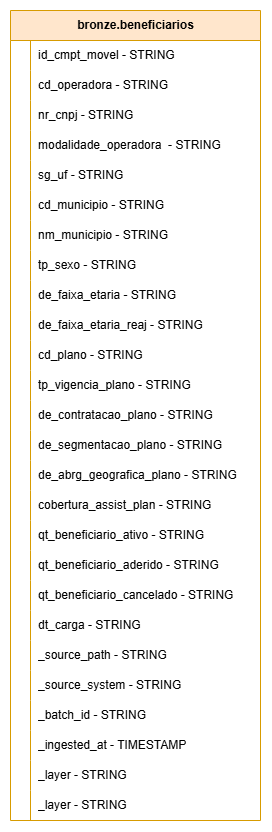
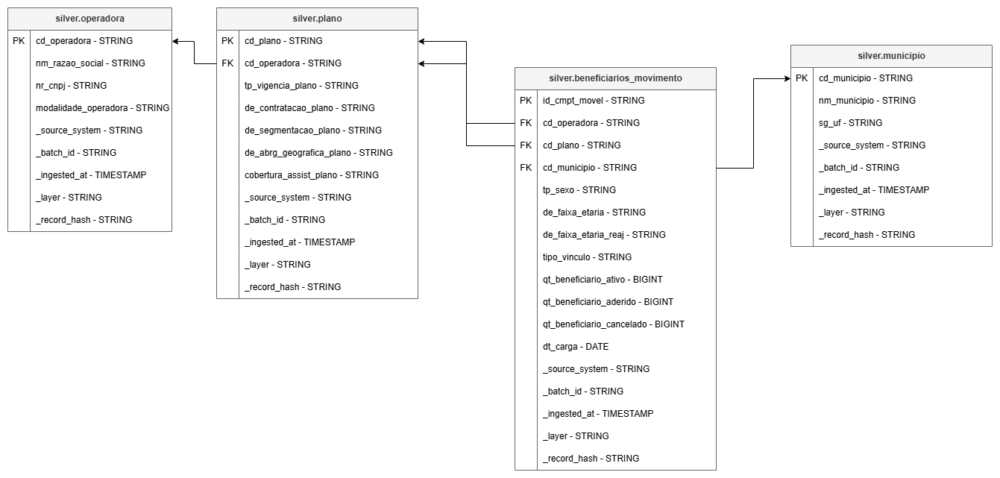
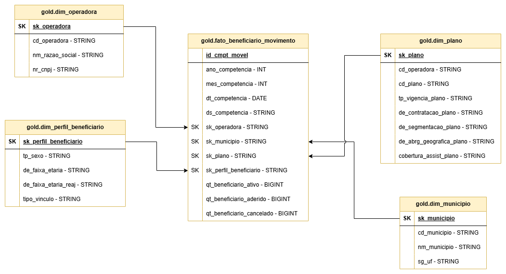

# Beneficiarios ANS

Projeto de pipeline de dados para ingestao e tratamento dos dados publicos de beneficiarios da ANS, com organizacao em camadas de Data Lake:

- **Raw**: arquivos extraidos da ANS publicados no HDFS.
- **Bronze**: leitura dos CSVs crus e carga completa em tabela Iceberg.
- **Silver**: limpeza, validacao, deduplicacao e modelagem das entidades analiticas em tabelas Iceberg.
- **Gold**: modelagem dimensional para consumo analitico e relatorios.

O projeto foi criado para execucao em ambiente Big Data com Hadoop HDFS, Spark, Hive Metastore, Apache Iceberg e JupyterHub/JupyterLab.

## Estrutura

```text
.
├── ans_ingestion/              # Pipeline Python de ingestao da ANS para HDFS raw
├── img/                        # Diagramas e imagens da documentacao
├── pipeline_utils/             # Catalogo Iceberg, configuracao e SQL dos pipelines
│   ├── sql/                    # Consultas SQL completas executadas pelos notebooks
│   └── tests/                  # Contratos estaticos dos pipelines SQL
├── load_bronze_layer.ipynb     # Notebook de carga da camada Bronze
├── load_silver_layer.ipynb     # Notebook de carga da camada Silver
├── load_gold_layer.ipynb       # Notebook de carga da camada Gold
├── beneficiarios_reports.ipynb # Consultas Spark SQL de relatorios da camada Gold
├── utils.py                    # Barrel module para importar utilitarios nos notebooks
└── README.md
```

## Fluxo de dados

```text
Portal de Dados Abertos ANS
        |
        v
ans_ingestion
        |
        v
HDFS raw: /dados/raw/ans/YYYYMM/
        |
        v
load_bronze_layer.ipynb
        |
        v
Iceberg: bronze.beneficiarios
         (snapshot/tag da execucao)
        |
        v
load_silver_layer.ipynb
        |
        v
Iceberg: silver.operadora
         silver.municipio
         silver.plano
         silver.beneficiario_movimento
         silver.beneficiario_rejeitado
         (snapshot/tag de cada tabela)
        |
        v
load_gold_layer.ipynb
        |
        v
Iceberg: gold.dim_operadora
         gold.dim_municipio
         gold.dim_plano
         gold.dim_perfil_beneficiario
         gold.fato_beneficiario_movimento
         (snapshot/tag de cada tabela)
        |
        v
beneficiarios_reports.ipynb
```

## Componentes principais

### `ans_ingestion/`

Pipeline Python responsavel por:

- listar as competencias disponiveis no diretorio publico da ANS;
- selecionar a competencia mais recente dentro dos filtros configurados;
- baixar arquivos ZIP validos;
- validar os caminhos internos dos ZIPs;
- extrair os arquivos localmente;
- publicar os dados no HDFS usando area de staging;
- evitar reprocessamento de competencias ja publicadas.

Veja a documentacao detalhada em [`ans_ingestion/README.md`](ans_ingestion/README.md).

### `load_bronze_layer.ipynb`

Notebook Spark que le os arquivos da camada raw e grava a tabela `bronze.beneficiarios` em Iceberg.



A camada Bronze mantem os dados proximos ao formato original recebido da ANS. As colunas de negocio sao gravadas como `STRING`, evitando perda de informacao por inferencia automatica de tipos na primeira etapa do pipeline. O notebook cria uma view CSV via SQL e executa a consulta completa em `pipeline_utils/sql/bronze_insert.sql` com `spark.sql`.

Principais responsabilidades:

- leitura recursiva dos CSVs em `HDFS_BASE_URI/dados/raw/ans/`;
- leitura dos arquivos publicados por uma view CSV criada com SQL;
- cast explicito das colunas de negocio para `STRING`;
- recomputacao completa com `INSERT OVERWRITE`;
- criacao de um snapshot Iceberg e de uma tag da execucao.

### `load_silver_layer.ipynb`

Notebook Spark que transforma a Bronze em tabelas Silver.



A camada Silver separa a tabela Bronze em entidades mais limpas e reutilizaveis. `silver.beneficiario_movimento` preserva a granularidade do movimento por competencia e se relaciona com as tabelas de referencia `silver.operadora`, `silver.plano` e `silver.municipio`. Toda a limpeza, tipagem, validacao e deduplicacao esta escrita em SQL completo nos arquivos `pipeline_utils/sql/silver_*.sql`.

Principais responsabilidades:

- leitura da tabela `bronze.beneficiarios`;
- leitura do estado atual da Bronze;
- limpeza de strings, datas, codigos e identificadores com CTEs SQL;
- validacao das regras de negocio e separacao dos registros rejeitados;
- deduplicacao deterministica com `ROW_NUMBER()`;
- recomputacao completa das tabelas com `INSERT OVERWRITE`;
- criacao de snapshots e tags Iceberg para cada tabela Silver.

### `load_gold_layer.ipynb`

Notebook Spark que transforma a Silver em um modelo dimensional Gold para analises e relatorios.



A camada Gold organiza os movimentos de beneficiarios em uma tabela fato, `gold.fato_beneficiario_movimento`, ligada as dimensoes `gold.dim_operadora`, `gold.dim_municipio`, `gold.dim_plano` e `gold.dim_perfil_beneficiario`. Esse modelo facilita consultas por competencia, operadora, municipio, UF, plano, sexo, faixa etaria e tipo de vinculo. As chaves substitutas sao calculadas dentro do SQL; nao ha colunas tecnicas de carga nas tabelas.

Principais responsabilidades:

- leitura das tabelas Silver materializadas;
- criacao de chaves substitutas com `SHA2` em SQL;
- montagem das dimensoes e da fato com CTEs e `JOIN` SQL;
- escrita atomica com `INSERT OVERWRITE`;
- criacao de snapshots e tags Iceberg para cada tabela Gold.

### `beneficiarios_reports.ipynb`

Notebook Spark SQL com consultas de relatorio sobre a modelagem Gold, incluindo visoes por competencia, UF, operadora, perfil de beneficiario, tipo de vinculo, plano e municipio. As consultas usam diretamente as referencias `tag_<ICEBERG_GOLD_TAG>` das tabelas Gold, garantindo que todos os relatorios leiam o mesmo estado historico.

### `pipeline_utils/`

Pacote de apoio usado pelos notebooks:

- `sql/`: uma consulta completa por etapa de transformacao, sem builders ou fragmentos SQL em Python;
- `iceberg_catalog.py`: criacao de namespaces, validacao de schemas e tags de snapshots;
- `pipeline_config.py`: leitura de configuracoes de ambiente;
- `constants.py`: constantes de configuracao compartilhadas.

Os notebooks usam Python somente para configurar a sessao, validar identificadores/campos, ler os arquivos SQL e executar `spark.sql`. Transformacoes de dados nao usam a API de DataFrames.

### SQL e rastreabilidade Iceberg

Cada transformacao possui uma consulta SQL completa em `pipeline_utils/sql/`. Os notebooks nao montam fragmentos de consulta nem encadeiam operacoes como `select`, `where`, `join` ou `withColumn`; eles apenas carregam o SQL e o executam com `spark.sql`.

Os arquivos SQL sao organizados por camada:

- `bronze_insert.sql`: carga completa da Bronze;
- `silver_validated.sql`, `silver_operadora.sql`, `silver_municipio.sql`, `silver_plano.sql`, `silver_movimento.sql` e `silver_rejeitados.sql`: validacao e materializacao da Silver;
- `gold_dim_operadora.sql`, `gold_dim_municipio.sql`, `gold_dim_plano.sql`, `gold_dim_perfil.sql` e `gold_fato_movimento.sql`: dimensoes e fato da Gold.

As tabelas analiticas armazenam somente colunas de negocio e medidas. O estado de cada execucao fica no historico nativo do Iceberg: cada `INSERT OVERWRITE` gera um snapshot, e o notebook cria uma tag com o prefixo da camada (`ans_bronze_`, `ans_silver_` ou `ans_gold_`). O helper `tag_current_snapshot` consulta a tabela `snapshots` e associa a tag ao snapshot mais recente.

Para relatórios reproduzíveis, `beneficiarios_reports.ipynb` exige `ICEBERG_GOLD_TAG` e consulta todas as tabelas Gold pela referência `tag_<ICEBERG_GOLD_TAG>`. Assim, as consultas usam um estado histórico consistente, sem depender de metadados gravados em cada linha.

## Requisitos

- Python 3.12+
- Hadoop HDFS
- WebHDFS habilitado
- Apache Spark com suporte a Iceberg
- Hive Metastore
- JupyterLab/JupyterHub para execucao dos notebooks
- Dependencias Python de `ans_ingestion/requirements.txt`

Instale as dependencias da ingestao:

```bash
pip install -r ans_ingestion/requirements.txt
```

## Configuracao

As principais variaveis de ambiente sao:

```bash
export HDFS_BASE_URI=hdfs://localhost:9000
export HDFS_WEB_URL=http://localhost:9870
export HDFS_USER=edivan
export ICEBERG_GOLD_TAG=ans_gold_YYYYMMDDHHMMSS_UUID

export ANS_SOURCE_URL=https://dadosabertos.ans.gov.br/FTP/PDA/informacoes_consolidadas_de_beneficiarios-024/
export ANS_SOURCE_START_PERIOD=
export ANS_SOURCE_END_PERIOD=
export ANS_HDFS_DIR=hdfs://localhost:9000/dados/raw/ans/
export ANS_LOCAL_TMP_DIR=/tmp/ans
export ANS_REQUEST_TIMEOUT_SECONDS=60
export ANS_DOWNLOAD_RETRIES=3
export ANS_DOWNLOAD_RETRY_BACKOFF_SECONDS=5
export LOG_LEVEL=INFO
```

Existe um exemplo em [`ans_ingestion/.env.example`](ans_ingestion/.env.example).

## Execucao

### 1. Ingerir dados crus para o HDFS

Na raiz do projeto:

```bash
python -m ans_ingestion.main
```

A carga publica os arquivos em:

```text
/dados/raw/ans/YYYYMM/
```

### 2. Carregar a camada Bronze

Abra e execute:

```text
load_bronze_layer.ipynb
```

Resultado esperado:

```text
bronze.beneficiarios
```

### 3. Carregar a camada Silver

Abra e execute:

```text
load_silver_layer.ipynb
```

Resultados esperados:

```text
silver.operadora
silver.municipio
silver.plano
silver.beneficiario_movimento
silver.beneficiario_rejeitado
```

### 4. Carregar a camada Gold

Abra e execute:

```text
load_gold_layer.ipynb
```

Resultados esperados:

```text
gold.dim_operadora
gold.dim_municipio
gold.dim_plano
gold.dim_perfil_beneficiario
gold.fato_beneficiario_movimento
```

### 5. Executar relatorios

Defina `ICEBERG_GOLD_TAG` com a tag criada pelo `load_gold_layer.ipynb` antes de executar o notebook. A tag deve existir em todas as cinco tabelas Gold.

Abra e execute:

```text
beneficiarios_reports.ipynb
```

## Testes

A suite de testes cobre a ingestao e os contratos estaticos dos pipelines SQL:

```bash
PYTHONPATH=ans_ingestion:. python -m unittest discover -s ans_ingestion/tests
PYTHONPATH=ans_ingestion:. python -m unittest discover -s pipeline_utils/tests
```

## Observacoes operacionais

- A ingestao raw continua incremental por competencia; as camadas analiticas sao recomputadas integralmente a cada execucao.
- Cada `INSERT OVERWRITE` cria um novo snapshot Iceberg; as tags nomeiam o estado publicado de cada camada.
- As tabelas Bronze, Silver e Gold nao armazenam `_batch_id`, `_source_path`, `_record_hash`, `_rejection_reason`, timestamps ou outras colunas operacionais.
- Os relatorios devem receber uma tag Gold explicita para evitar mistura de estados entre tabelas.
- Configure `HDFS_BASE_URI` antes de executar os notebooks, pois os caminhos de warehouse, raw e checkpoint dependem dele.
- Tags e snapshots precisam de uma politica de retencao que preserve os estados usados para auditoria e relatorios historicos.
